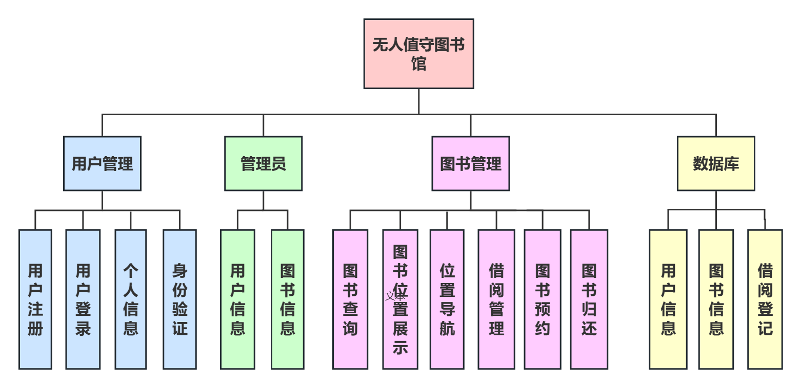
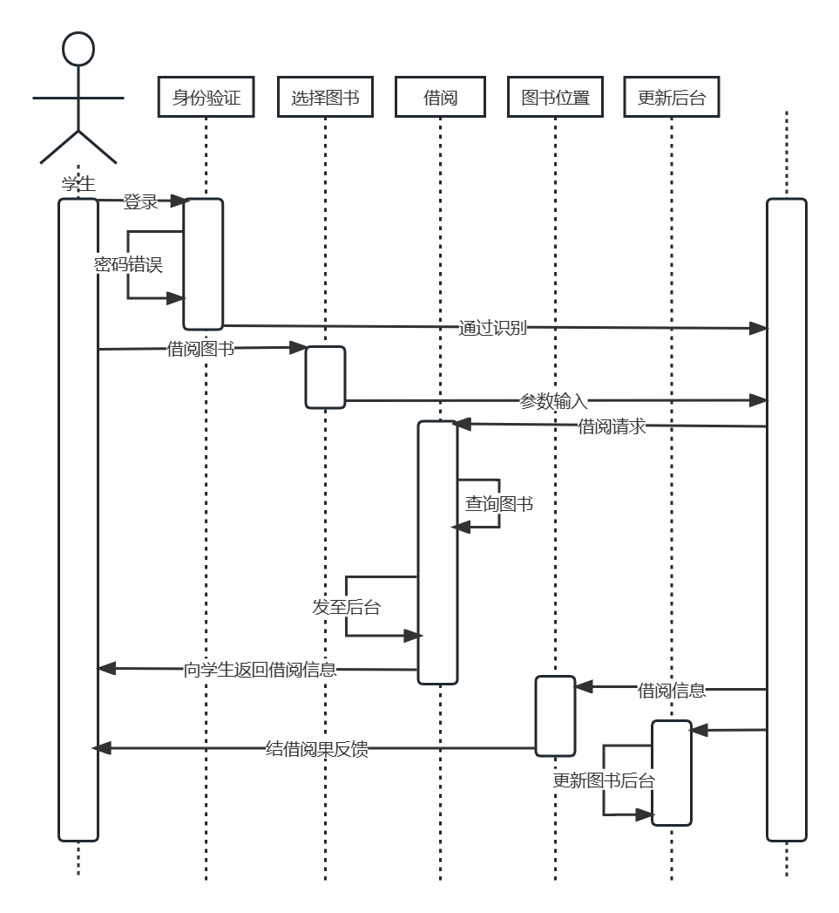
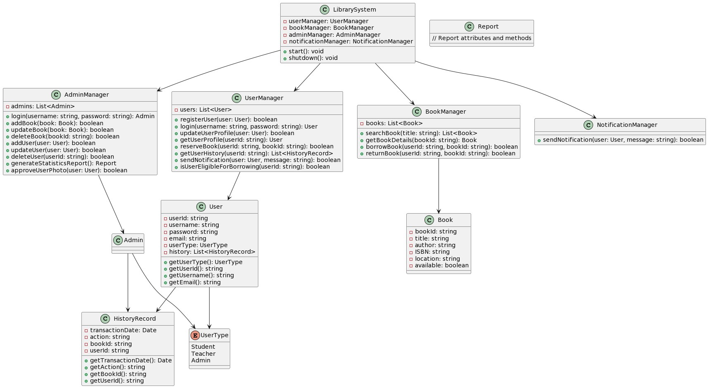

# 总体架构设计

## 一．分层架构模式

系统的总体架构采用分层架构模式，包括以下关键组件

### 1.用户界面层

这是用户与系统互动的界面，包括自助终端和在线用户界面。用户可以通过自助终端实现借还书、查询图书等操作，也可以通过在线用户界面进行远程操作和管理个人信息。

### 2.应用层

应用层负责处理用户请求和业务逻辑。它包括以下子组件：

+ 借还书管理：处理借阅和归还书籍的请求，记录借阅历史。
+ 图书查询和导航：处理图书查询请求，提供图书信息和导航服务。
+ 用户管理：处理用户注册、登录、个人信息管理、通知偏好等用户相关操作。
+ 管理员功能：支持管理员管理图书、用户、设备参数等操作。
+ 通知服务：负责发送各种通知，如逾期提醒、借阅成功通知等。
+ 业务逻辑层：业务逻辑层包含业务规则、验证和数据处理。它确保用户请求的合法性，并与数据库交互以检索或更新数据。

### 3.数据层

+ 数据层包括数据库和存储系统。数据库用于存储用户信息、图书信息、借阅记录和系统配置。存储系统用于存储用户上传的个人照片和其他文件。

### 4.硬件设备层

+ 这是系统与用户互动的硬件设备，包括自助终端、扫描仪、自动书架、打印机、网络设备等。这些设备用于实际的借还书操作和用户交互。

系统的模块结构如下：

系统时序图如下：

系统类图如下：

## 二．技术选型

### 1.用户界面层

可以使用跨平台框架（React Native）开发自助终端应用程序，并使用Web技术（HTML、CSS、JavaScript）构建在线用户界面。

### 2.应用层

可以使用现代编程语言和框架（JAVA Spring Boot）开发应用层服务。

### 3.业务逻辑层

业务逻辑可以通过编写服务类和中间件来实现，确保数据验证和处理。

### 4.数据层

可以选择关系型数据库（MySQL）来存储结构化数据，并使用云存储服务（Amazon S3）来存储用户上传的文件。

### 5.硬件设备层

硬件设备需要与应用层进行通信，可能需要使用适当的通信协议。

## 三. 质量要求

### 1.性能场景

+ 在系统处于高峰时期，保证登陆的每个顾客所作的选择和查询的响应时间能在5s以内，如果需要等待则给出有友好的提示。系统可以保证以最快速度同时响应500个用户的操作。

### 2.易用性场景

+ 在该系统中，用户希望在运行时能尽快取消某操作使错误的影响降到最低，取消在1秒内发生；要求具有基本电脑操作常识的人，可以根据良好的界面设计迅速学会使用方法，让熟手用户使用快捷键。

### 3.可用性场景

+ 在正常的工作时间内，系统必须具有极高的可用性，保证出故障几率最低。出现故障时系统有相应的处理机制。

### 4.安全性场景

+ 1.身份验证和授权：确保用户身份验证，只有经过授权的用户才能访问敏感功能。
+ 2.数据加密：使用SSL/TLS来保护数据在传输过程中的机密性。在数据库中存储敏感信息之前进行加密。
+ 3.访问控制：实施细粒度的访问控制，确保用户只能访问其授权的数据和功能。
+ 4.安全审计：记录关键操作和事件，以便跟踪和分析安全事件。
+ 5.漏洞管理：定期进行漏洞扫描和安全审计，及时修复潜在的安全漏洞。

## 五．扩展性和性能优化

考虑到可扩展性和性能，采用以下策略：

+ 负载均衡：使用负载均衡器分发流量，以确保应用层服务能够处理高流量。

+ 缓存：使用缓存技术（如Redis）来缓存热门数据，减轻数据库负担。

+ 水平扩展：设计应用层服务以支持水平扩展，以便根据需要添加更多的服务器实例。

+ 数据库优化：优化数据库查询和索引以提高查询性能。

## 六．监控和日志记录

+ 实施监控和日志记录，以便实时监测系统状态和问题排查。使用工具如Prometheus、Grafana和ELK Stack来实现监控和日志记录。
